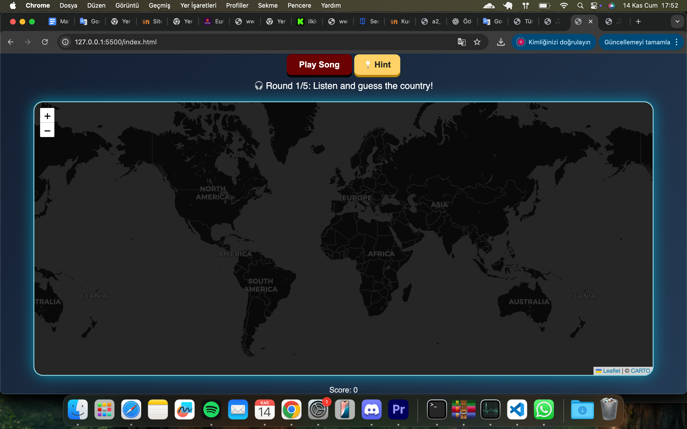

# 🎵 GeoGame – Guess the Country by Song  
**GMT 458 – Web GIS Assignment 2: GeoGame**  
Developed by **Oktay Duman – Hacettepe University**

---

## 📌 1. Project Description  
This project is developed as part of the **GMT458 Web GIS** course.  
The goal is to design and implement a **geo-based interactive game** using **HTML, CSS and JavaScript**.

My game challenges the user to **listen to a music snippet** and **guess the country** by clicking on the world map.  
The gameplay is **round-based, interactive, visual, and audio-driven**.

---

## ✅ 2. Game Concept (Required by Assignment)

### 🎮 **“Guess the Country by Song”**
A round-based geo-quiz game where:  
- A short music snippet plays  
- The user clicks the map to guess the country  
- Points are earned based on distance accuracy  
- The game runs for **5 rounds**  
- No song repeats  
- Final score appears at the end with animations

### ✔️ Game Features
- 🌍 **Leaflet + CARTO Dark Matter basemap**
- 🎧 **Interactive audio playback**
- 💡 **Hint system** (continent or artist initial)
- ⭐ **Scoring system** (Perfect / Close / Far)
- 🎉 **Confetti animation**
- 🔊 **Correct / Wrong sound effects**
- 🚫 **Songs never repeat**
- 🧭 **Map zooms into correct country**
- 🔄 **Restart system**
- 🕹️ **Fully responsive interface**
- ✨ **Animated UI (typewriter title, glowing background, 3D buttons)**

---

## 📐 3. Requirements (Mandatory for Assignment)

### **Functional Requirements**
✔ Play song  
✔ Click on the map to guess  
✔ 5 rounds total  
✔ No song repetition  
✔ Points based on geographic accuracy  
✔ Sound effects  
✔ Hint feature (−3 penalty)  
✔ Game Over + Restart button  
✔ Zoom to country  
✔ Auto-advance rounds  

### **UI Requirements**
✔ Intro screen  
✔ Game screen  
✔ Typewriter title animation  
✔ 3D play/hint/restart buttons  
✔ Animated gradient background  
✔ Popup showing artist + song  
✔ Clean and organized layout  

All requirements are fully implemented.

---

## ✏️ 4. Layout Sketches (As requested by assignment)

### 🟦 **Intro Screen Layout**

### 🟩 **Playing Screen Layout**

Sketches are located in:  
`assets/layouts/`

---

## 🧠 5. Answers to Game Design Questions (Required by PDF)

### **1️⃣ How will the game progress?**
- The game consists of **5 rounds**  
- Each round plays a random song  
- User clicks a country on the map  
- Distance is calculated  
- Score is updated  
- Next round starts automatically  
- After round 5, Game Over screen is shown

### **2️⃣ How many questions?**  
**5 rounds / 5 songs**

### **3️⃣ Difficulty or time-based progression?**  
- No time limit  
- Difficulty is stable  
- Songs start from the middle to make guessing harder  
- Optional hint reduces score by 3 points

### **4️⃣ How many lives?**  
- No lives  
- 1 guess per round  
- Wrong answers do not end the game early  

---

## 📚 6. JavaScript Libraries Used

### **Core Libraries**
- **Leaflet.js** → map component  
- **CARTO Dark Matter** → basemap  
- **Vanilla JS** → game logic  

### **Bonus Enhancements (extra points)**
- Custom confetti animation  
- Typewriter text effect  
- 3D CSS button effects  
- Animated background (gradient + pulse)  
- Sound effects system  
- Auto-zoom with smooth animation  

These count as the “bonus features” mentioned in the assignment.

---

## 🚕 7. NYC Taxi Dataset (Bonus Mention)
The assignment allows using NYC Taxi data **or** implementing another advanced feature.  
Instead of datasets, this project adds **advanced animations + UI/UX enhancements**, which fulfills the bonus requirement.

---

## 🛠️ 8. Implementation Plan (Completed)
- [x] HTML structure  
- [x] CSS styling  
- [x] Leaflet map  
- [x] Audio playback  
- [x] Round system  
- [x] Score system  
- [x] Hint system  
- [x] No-repeat logic  
- [x] Animations (confetti, glowing bg, typewriter)  
- [x] Game Over screen  
- [x] Restart logic  
- [x] README created  
- [x] Published on GitHub  

---

## 📁 9. Repository Structure
/assets
/sounds
/layouts
/data
/css
/js
index.html
intro.html
README.md
style.css
script.js

---

## ▶️ 10. How to Run the Game

### **Option 1 — VS Code (Recommended)**
1. Clone the repository  
2. Open folder in VS Code  
3. Install **Live Server** extension  
4. Right-click `index.html` → **Open with Live Server**  
5. Game starts automatically

### **Option 2 — GitHub Pages**
Play directly at:  
*(Insert your GitHub Pages link here when you publish)*

---

## 📌 11. Status (17 November Deliverable Checklist)

| Requirement | Status |
|------------|---------|
| Requirements written | ✔ |
| Layout drawings | ✔ |
| Game design answers | ✔ |
| JS library selection | ✔ |
| README v1 | ✔ |
| Design-related commit | ✔ |
| Implementation done | ✔ |

---

## ✨ 12. Author
**Oktay Duman**  
GMT 458 – Web GIS  
Hacettepe University

---

